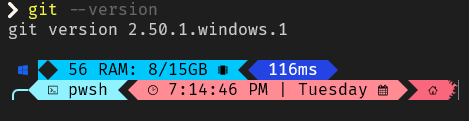
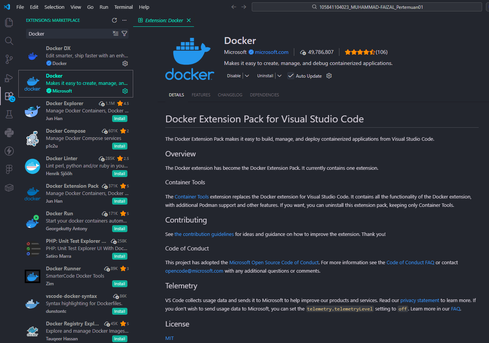

# Laporan Praktikum Pertemuan 01

## 1. Penjelasan tentang DevOps dan Mengapa Penting

**DevOps** adalah serangkaian praktik, budaya, dan alat yang menggabungkan pengembangan perangkat lunak (Dev) dan operasi teknologi informasi (Ops). Tujuannya adalah untuk memperpendek pengembangan siklus hidup sistem dan memberikan pengiriman perangkat lunak secara berkelanjutan dengan kualitas perangkat lunak yang tinggi.

**Mengapa DevOps penting?**
- **Pengiriman lebih cepat:** Mempercepat proses dan frekuensi rilis dari kode ke produksi.
- **Kolaborasi yang lebih baik:** Menyatukan tim pengembang (developer) dan operasi (IT operations) untuk bekerja secara lebih sinkron.
- **Efisiensi dan Otomatisasi:** Mengurangi pekerjaan manual yang berulang melalui CI/CD (Continuous Integration / Continuous Deployment).
- **Kualitas dan Keandalan:** Bug dapat terdeteksi lebih awal sehingga meningkatkan kualitas dan kelancaran rilis aplikasi.

## 2. Penjelasan Tools Pendukung

### Docker
**Docker** adalah platform perangkat lunak yang memungkinkan pengembang untuk membuat, menguji, dan mendeploy aplikasi dengan cepat di dalam lingkungan terisolasi yang disebut *container*. Container ini membungkus kode perangkat lunak beserta seluruh dependensinya (pustaka, alat sistem, dan runtime), sehingga aplikasi dijamin dapat berjalan secara konsisten di lingkungan apa pun, dari laptop penguji hingga ke server produksi.

### GitLens
**GitLens** adalah ekstensi populer (add-on) pada Visual Studio Code yang secara signifikan meningkatkan fitur manajemen kontrol *source code* (Git) bawaan dari editor tersebut. Fitur utamanya adalah *inline git blame*, yang menampilkan siapa, kapan, dan detail komit apa yang mengubah suatu baris kode. Ekstensi ini sangat mempermudah pelacakan perubahan sejarah kode, review kode, dan kerja sama antar developer dalam satu tim.

### YAML
**YAML** (kependekan rekursif dari *YAML Ain't Markup Language*) adalah standar format serialisasi data (seperti JSON atau XML) yang sangat mudah dibaca oleh manusia. Format pembacaannya berbasis indentasi spasi dan elemen yang lebih sedikit. Di dunia DevOps yang modern, file `.yml` atau `.yaml` secara luas digunakan sebagai format penulisan file konfigurasi standar, seperti pada konfigurasi Docker Compose, Kubernetes, GitLab CI/CD, hingga GitHub Actions pipelines.

## 3. Screenshot Environment yang Sudah Di-setup

Berikut adalah bukti dokumentasi screenshot environment dari tools yang telah dikonfigurasi:

### Git Version

### Docker Version

### Docker Setup

### VSCode Extensions (GitLens & YAML)

