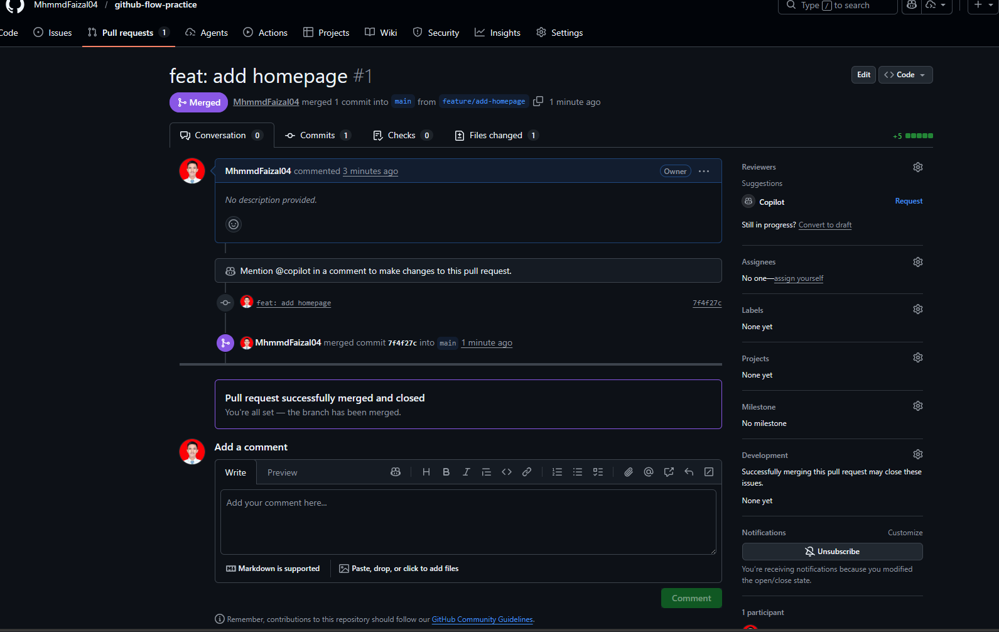
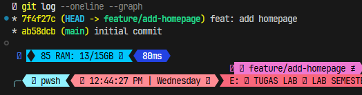
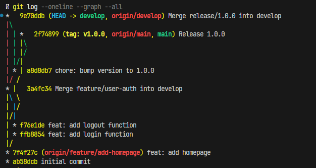
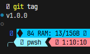
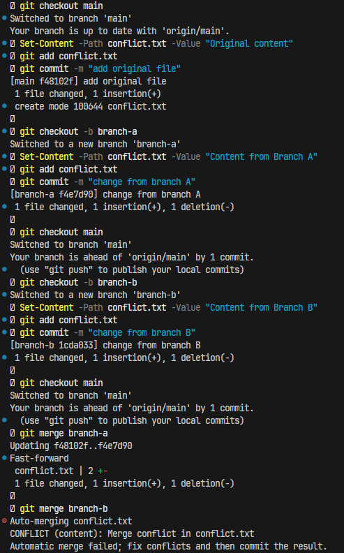
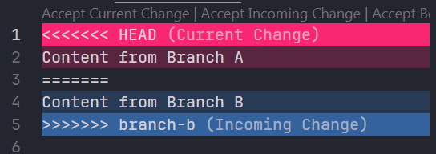
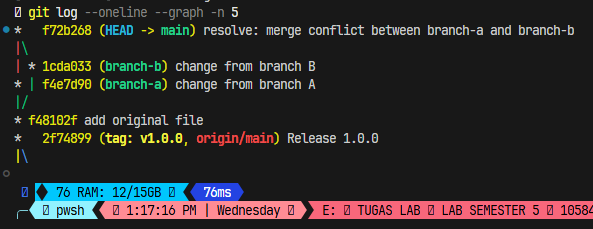

# Laporan Praktikum Pertemuan 03

## Identitas Praktikan
| Keterangan | Detail |
| :--- | :--- |
| **Nama** | Muhammad Faizal |
| **NIM** | 105841104023 |
| **Kelas** | 5B RPL |
| **Tanggal Pengerjaan** | 25 Februari 2026 |

---

## Checklist Praktikum
- [x] Memahami perbedaan GitHub Flow dan GitFlow
- [x] Berhasil membuat dan merge feature branch
- [x] Berhasil membuat release dengan GitFlow
- [x] Berhasil menyelesaikan merge conflict
- [x] Semua screenshot lengkap dan jelas (tersemat pada laporan di bawah)
- [x] Commands terdokumentasi dengan baik

---

## Daftar Tugas & Hasil Dokumentasi

### Task 1: Implementasi GitHub Flow
- Laporan baris perintah: [task1-github-flow/commands.md](task1-github-flow/commands.md)
- Link Pull Request (PR): [task1-github-flow/pr-link.txt](task1-github-flow/pr-link.txt)

**Screenshots Task 1:**
1. **Tampilan Pull Request di GitHub**
   
   
2. **Output `git log --oneline --graph`**
   

---

### Task 2: Implementasi GitFlow
- Laporan baris perintah: [task2-gitflow/commands.md](task2-gitflow/commands.md)
- Penjelasan alur branch: [task2-gitflow/branch-diagram.md](task2-gitflow/branch-diagram.md)

**Screenshots Task 2:**
1. **Visualisasi Branch (Semua Branch)**
   

2. **Output Tag Rilis Git**
   

---

### Task 3: Resolve Merge Conflict
- File sebelum kondisi resolve: [task3-conflict/conflict-before.txt](task3-conflict/conflict-before.txt)
- File setelah berhasil di-resolve: [task3-conflict/conflict-after.txt](task3-conflict/conflict-after.txt)
- Langkah-langkah penyelesaian: [task3-conflict/resolution-steps.md](task3-conflict/resolution-steps.md)

**Screenshots Task 3:**
1. **Output git status saat terjadi konflik**
   

2. **Isi file yang terdapat conflict markers**
   

3. **Output git log setelah merge sukses**
   
